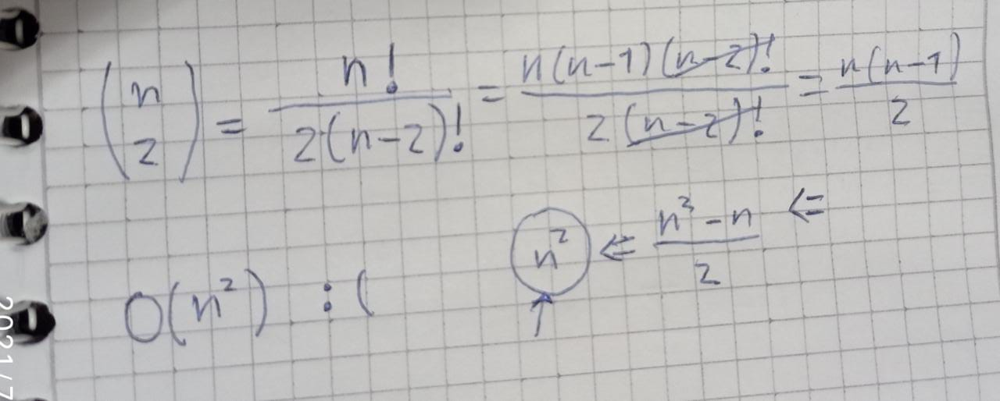
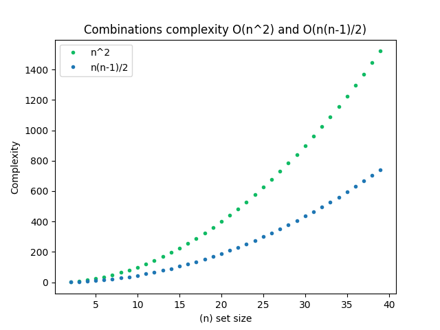
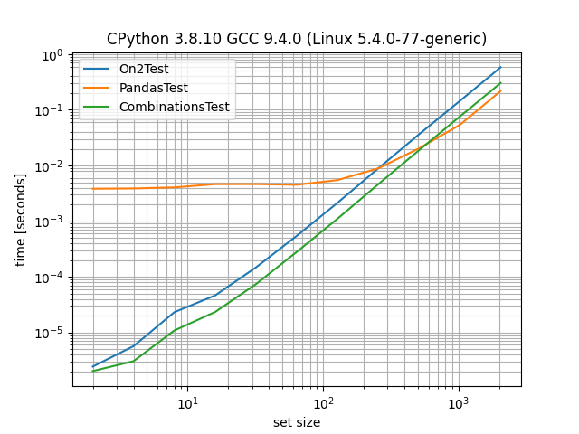

# Test

I tried various algorithms of which I did not find a way to do better than the ones I show below
## Requirements

~~~
pip install -r requirements.txt
~~~
Maybe also need install tkinter

if you have linux
~~~
sudo apt-get install python3-tk
~~~

## Usage
~~~
python app.py {totalheight}
~~~

## - O (n ^ 2): 
It is the typical algorithm of traversing an array n ^ 2 times to achieve the objective

Here, I looped through the two arrays to simulate the n ^ 2

## - Pandas: (used)
It uses the characteristics of numpy, which is theoretically more efficient because it runs in c, so it can give us a different time better.

Here, I do a consult of pandas dataframe and then iterate

## - Itertool combinations: 
I guess it should use the most specialized algorithm to do this kind of combinatorics so I think your combinatorics is O (n ^ 2), or the best in theory (n(n-1)/2).

Here, I used the itertools tool to generate the combined list of possible iterations "combinations" and then went through it

### Combinatory
You can change the

From complexity of combinatory is O (C (n, k)), here k is equal to 2 so 

## What means that?
it means that it is better than n ^ 2 but that it follows that growth line, so it is faster. But it affects him in a great way that it is of type n.

I was taught that n (n-1) / 2 is equal to n ^ 2 in big o notation, but is most fast. so I think it is impossible to improve in this case O (n ^ 2)

## Times in my machine
These times may vary and are not really reliable for all machines, but it makes a representation of which may be best.

You can reproduce this on your machine

~~~
python benchmarking.py
~~~

# About unit testing
I know I could improve my qualification as far as , but I really have done very few unit testings, so I prefer not to do it since it is not really my area of knowledge, I already researched how it is done, but it would not be real knowledge but reproduction of code that is in the cloud, if you want me to learn, I will do it with pleasure.